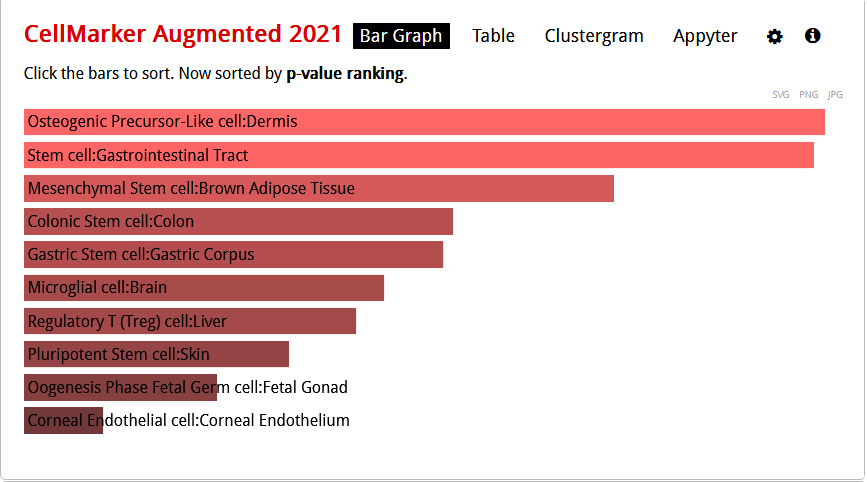
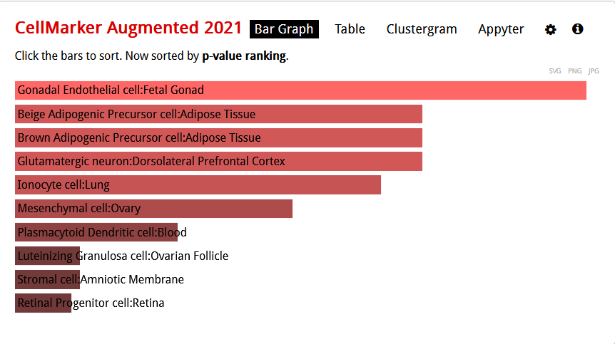
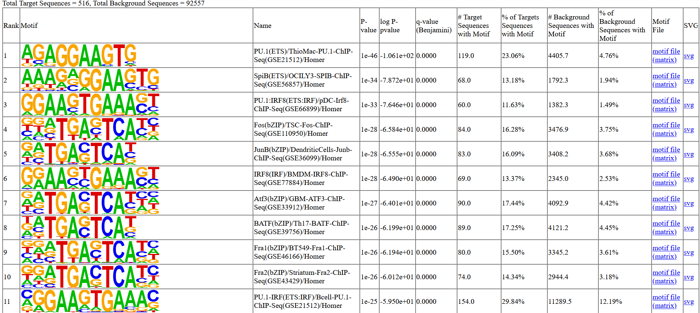
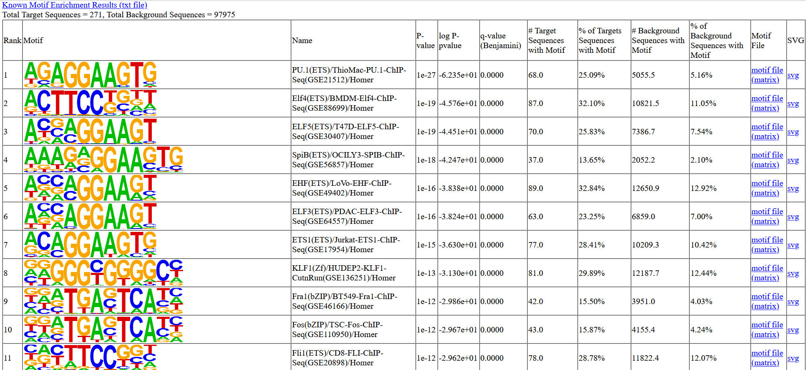
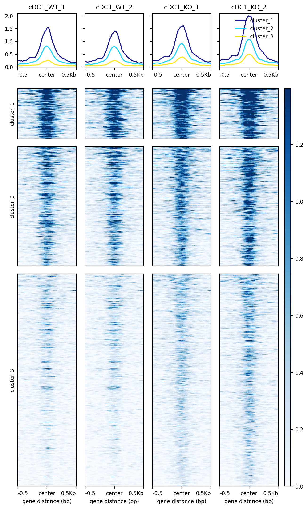
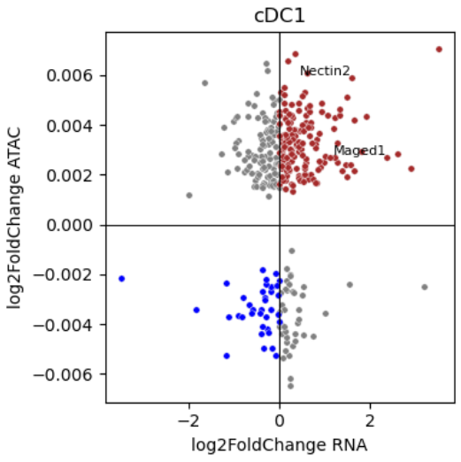
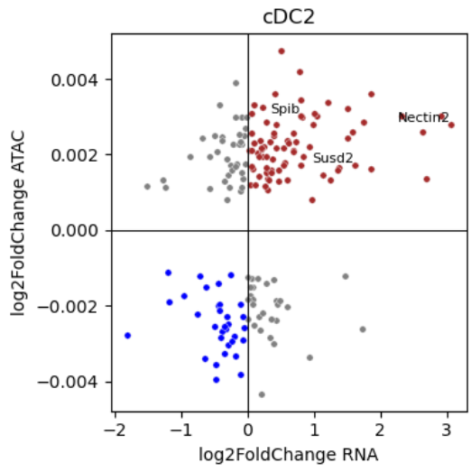
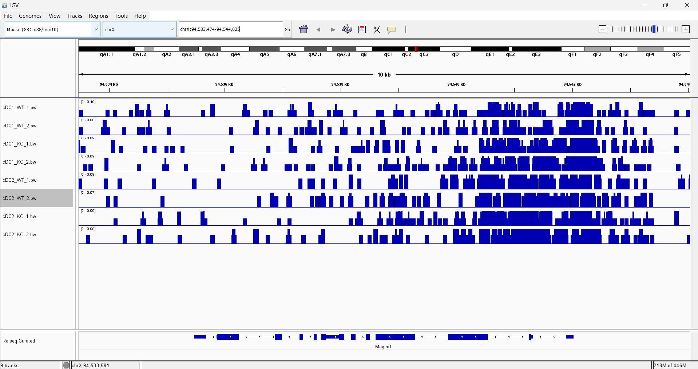
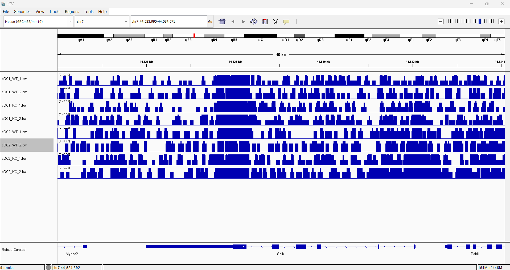

### How to run this pipeline

This pipeline processes single end ATAC-seq data and was developed to reproduce key results from Fernandes et al., 2024. The workflow is implemented in Nextflow, with individual processes organized in the modules/ directory. Sample metadata, including the mapping between SRA runs and experimental conditions, is provided as a CSV file in the refs/ directory.

The pipeline uses Conda for software management. All Conda environments are defined in the envs/ directory, with package versions pinned to the latest stable releases available at the time this project was completed.

To run the pipeline, Nextflow must be installed on the system. The workflow can then be executed with the following command:

nextflow run main.nf -profile conda,cluster

This command assumes access to a compute cluster and uses Conda to resolve all software dependencies.

All references used in this project are listed in the BibTeX file located at the top level of the repository. Downstream analysis and figure generation are performed in a Jupyter notebook titled report.ipynb, which contains all analysis code used for this project.

### Introduction

Dendritic cells are critical regulators of immune responses and play a central role in tumor immune surveillance by linking innate and adaptive immunity. Conventional dendritic cells are broadly classified into cDC1 and cDC2 subsets, along with plasmacytoid dendritic cells. cDC1 cells are characterized by high interleukin-12 production and promote T helper 1 mediated anti-tumor immunity, while cDC2 cells preferentially drive T helper 2 and T helper 17 responses. Plasmacytoid dendritic cells are distinct in their capacity to produce type I interferons, particularly in response to viral stimuli.

Fernandes et al., 2024 investigated how histone deacetylases regulate dendritic cell development and function, with a particular focus on HDAC1 and HDAC2. Using genetically engineered mouse models, the authors examined how loss of these enzymes affects dendritic cell differentiation, chromatin accessibility, and transcriptional programs across multiple dendritic cell subsets. The study integrated RNA sequencing and ATAC-seq to characterize changes in gene expression and chromatin accessibility associated with HDAC deletion.

For the ATAC-seq component, sorted cells underwent tagmentation prior to sequencing. Single end reads were aligned to the GRCm38 reference genome using Bowtie2 with ATAC-seq specific alignment parameters. Alignments overlapping ENCODE blacklisted regions were removed, and peaks were called on a per sample basis using MACS2 with the --nomodel, --keep-dup auto, and --extsize 147 options. Quality control metrics were summarized using MultiQC. Differential chromatin accessibility analysis was performed using DiffBind with edgeR and TMM normalization, and peaks were considered differentially accessible at a p value threshold of 0.01.

In this project, a Nextflow workflow was developed to reproduce the ATAC-seq analysis described in Fernandes et al., 2024. The goal of this work was to implement a reproducible and automated pipeline for ATAC-seq processing and to assess how closely the resulting quality metrics, differential accessibility results, and downstream enrichment analyses recapitulate the findings reported in the original study.

### Methods

ATAC-seq data were obtained from the Fernandes et al., 2024 study using the project accession PRJNA1107625, associated with GEO accession GSE266584. The mouse reference genome, mm10, and corresponding RefSeq gene annotation in GTF format were downloaded from NCBI, and transcription start site annotations were obtained from the UCSC Genome Browser.

ATAC-seq run accessions and sample metadata were retrieved using Entrez Direct v24.0. The esearch and efetch utilities were used to query the SRA and export run level metadata to a CSV file. Raw sequencing data were downloaded using SRA Tools v3.2.1 with prefetch followed by fasterq-dump.

Initial quality control was performed using FastQC v0.12.1 and samtools flagstat from SAMtools v1.20, both run with default parameters. Adapter trimming and quality filtering were performed using Trimmomatic v0.40. Tn5 adapter sequences were obtained from Illumina and trimmed using the following single end parameters:

SE -phred33 <input.fastq> <output.fastq.gz> \
ILLUMINACLIP:<adapters>:2:30:10 \
LEADING:3 TRAILING:3 SLIDINGWINDOW:4:15 MINLEN:36

Quality control reports from FastQC, SAMtools, and Trimmomatic were aggregated using MultiQC v1.32 with default parameters.

The reference genome was indexed, and trimmed reads were aligned to mm10 using Bowtie2 v2.5.4 with the --very-sensitive option, with mitochondrial reads removed after alignment. Peak calling was performed on aligned reads using MACS2 v2.2.9.1 with the --nomodel, --keep-dup auto, and --extsize 147 parameters.

Genome wide coverage tracks were generated from the aligned BAM files using bamCoverage from deepTools v3.5.6 with a bin size of 10 and CPM normalization. Transcription start site signal matrices were generated using computeMatrix with a 500 bp window centered on the TSS. Signal profiles were visualized using plotProfile, and transcription start site enrichment scores were calculated using a custom Python script implemented with Python 3.14.1, pandas v2.3.3, and NumPy v2.3.5. Signal heatmaps were generated using plotHeatmap with k means clustering set to three clusters.

Fraction of Reads in Peaks scores were calculated using BEDTools v2.31.1 and SAMtools v1.20. Differential chromatin accessibility analysis was performed using DiffBind v3.16.0, with samples grouped into cDC1 and cDC2 conditions. Read counting and normalization were handled within DiffBind using DESeq2, with differentially accessible regions defined at a p value threshold of 0.01. The rtracklayer v1.66.0 and R v4.4.3 packages were used to support genomic data import and analysis.

For peak annotation and motif analysis, the mm10 genome was indexed using SAMtools. Differentially accessible peaks were annotated using annotatePeaks.pl from HOMER v5.1 with default parameters. Motif enrichment analysis was performed using findMotifsGenome.pl with a window size of 200 bp and motif lengths of 8, 10, and 12 bp.

To reproduce figures 6c and 6e from the original publication, normalized RNA-seq count matrices for cDC1 and cDC2 samples were downloaded from GEO accession GSE266583 and the corresponding SRA project PRJNA1107627.

In this pipeline, peaks were not split into gain and loss categories for downstream analysis. All significant peaks were considered together when performing enrichment, motif analysis, and figure reproduction. This approach differs from the original study, which separated peaks into gain and loss to highlight condition-specific accessibility changes.

### Quality control analysis

Looking at the MultiQC report general statistics, all samples had a high number of mapped reads. Reads mapped ranged from 16.8 million to 23.9 million. The amount of dropped reads ranged from 3.4% to 6.5% after trimming, which is within the normal range of dropped reads. GC content was 47-48% across all samples, and duplication ranged from 14.8-24.9%. Samtools flagstat reported high rates of passing quality control and mapped reads as well. Higher rates of duplication are most likely attributed to the tagmentation reaction needed for ATAC-seq. Looking at the FastQC scores, PHRED scores for all samples were above 30 and of high quality. Per sequence quality scores were also high, and per base N content was low.  Overrepresented sequences included CCCTAACCCTAACCCTAACCCTAACCCTAACCCTAACCCTAACCCTAACC and GGGTTAGGGTTAGGGTTAGGGTTAGGGTTAGGGTTAGGGTTAGGGTTAGG. 7/8 samples had warnings for adapters the nextera transposase sequence in the 36-40 bp range ranging from 5-10% of sequences.  Since there was a high rate of mapped reads, a stricter trimming paradigm was foregone. 

Overall, the high mapping rates reported by both FastQC and samtools flagstat indicate that the alignment strategy was successful and that the majority of reads were correctly assigned to the mm10 reference genome. These results suggest that the quality of the sequencing data, including read length, base quality, and adapter trimming, was sufficient to support accurate alignment. The consistent GC content and moderate duplication rates further support the reliability of the mapped reads. High mapping rates are particularly reassuring given the repetitive regions and relatively older assembly of the mm10 genome, indicating that downstream analyses such as peak calling and motif discovery are unlikely to be compromised by alignment artifacts.

To assess ATAC-seq–specific data quality, the TSS enrichment score and the fraction of reads in peaks (FRiP) were selected (Table 1). FRiP scores ranged from 0.0186 to 0.0270, which are on the lower end of commonly reported values for ATAC-seq experiments. Lower FRiP scores indicate that a smaller fraction of aligned reads overlap called peaks, which may reflect increased background signal or reduced sensitivity in peak detection. One contributing factor to the reduced FRiP values in this dataset is the use of single-end sequencing rather than paired-end sequencing. Single-end reads provide less information about fragment length and genomic context, which can reduce peak-calling resolution and consequently depress FRiP scores compared to paired-end ATAC-seq datasets. Despite the lower FRiP values, the presence of consistent peak calls across samples suggests that biologically meaningful chromatin accessibility signal is still present.

In contrast, TSS enrichment scores were robust and ranged from 11.61 to 14.65, meeting the ENCODE-recommended threshold for acceptable ATAC-seq data pertaining to the mm10 RefSeq genome (Table 2). TSS enrichment measures the aggregation of ATAC-seq signal at transcription start sites relative to flanking regions and is a strong indicator of signal-to-noise and library quality. High TSS enrichment scores indicate effective transposition at open chromatin regions and low background noise, supporting the conclusion that the experiment successfully captured chromatin accessibility at regulatory regions. Taken together, the strong TSS enrichment scores suggest that the ATAC-seq libraries are of high quality, and while FRiP scores are modest, they are likely influenced by technical choices rather than fundamental experimental failure.

### Table 1, FRiP scores

| run         | FRiP |
|-------------|-------|
| SRR28895185 | .0196 |
| SRR28895186 | .0186 |
| SRR28895189 | .0270 |
| SRR28895190 | .0208 |
| SRR28895183 | .0257 |
| SRR28895187 | .0236 |
| SRR28895184 | .0251 |
| SRR28895188 | .0196 |

Fraction of Reads in Peak (FRiP) per sample. 

### Table 2, TSS Enrichment scores

| Sample      | TSS_enrichment |
|-------------|----------------|
| SRR28895188 | 13.27285       |
| SRR28895190 | 14.05926       |
| SRR28895185 | 11.61250       |
| SRR28895184 | 14.64938       |
| SRR28895183 | 13.09953       |
| SRR28895189 | 12.24426       |
| SRR28895187 | 12.53440       |
| SRR28895186 | 13.38898       |

### Number of differentially accessible regions analysis

Using the same statistical thresholds reported by the authors, the pipeline identified 516 differentially accessible regions in cDC1 and 271 differentially accessible regions in cDC2. These values are lower than those reported in the original study, which identified 1,863 differentially accessible regions in cDC1 and 843 in cDC2. Despite the reduced number of significant regions, differential accessibility was still detected in both cell types, indicating that the pipeline was able to capture biologically relevant changes in chromatin accessibility.

Several methodological differences likely contribute to the observed discrepancy. Notably, the current analysis was performed using a more recent version of DiffBind (v3.16.0), which introduced substantial changes to default behavior, including standardized read counting using summarizeOverlaps(), automatic application of genome-specific blacklists, and normalization based on full library sizes. In addition, the authors’ analysis relied on edgeR for differential testing, whereas DESeq2 was used here. These differences in statistical modeling, normalization, and filtering stringency are well known to affect the number of regions called as differentially accessible. Because the authors did not fully specify their DiffBind parameters, an exact replication of their results is not possible. Nevertheless, the detection of hundreds of differentially accessible regions in both conditions suggests that the core biological signal is preserved, even if absolute counts differ. 

### Enrichment analysis

Differentially accessible peaks identified by HOMER were annotated to nearby genes, and these gene sets were compared with the RNA-seq results from Fernandes et al., 2024. The annotated gene lists were submitted to Enrichr, and enrichment was assessed using the CellMarker Augmented 2021 database to identify associated cell types (Tables 3 and 4; Figures 1 and 2).

For cDC1 differentially accessible regions, the top enriched cell types included osteogenic precursor-like cells from the dermis, gastrointestinal tract stem cells, and mesenchymal stem cells from brown adipose tissue. For cDC2 differentially accessible regions, the top cell types were gonadal endothelial cells from the fetal gonad, beige adipogenic precursor cells, and brown adipogenic precursor cells from adipose tissue; however, all adjusted p values for cDC2 enrichments were greater than 0.05, indicating limited statistical support.

The broader range of cell types associated with cDC1 differential peaks may reflect the functional importance of cDC1s in immune surveillance and their role in interleukin-12 production. In contrast, the lack of significant enrichment for cDC2 may indicate a more context-specific or subtle regulatory program in this subset under the conditions examined.. 

### Table 3, Enriched cell types against CellMarker Augmented 2021 for cDC1

| Index | Name                                         | P-value     | Adjusted p-value | Odds Ratio | Combined score |
|-------|----------------------------------------------|-------------|------------------|------------|----------------|
| 1     | Osteogenic Precursor-Like cell:Dermis        | 0.000002304 | 0.0009548        | 6.12       | 79.43          |
| 2     | Stem cell:Gastrointestinal Tract             | 0.000002560 | 0.0009548        | 6.05       | 77.91          |
| 3     | Mesenchymal Stem cell:Brown Adipose Tissue   | 0.00001555  | 0.003866         | 5.47       | 60.59          |
| 4     | Colonic Stem cell:Colon                      | 0.00006644  | 0.01080          | 5.08       | 48.82          |
| 5     | Gastric Stem cell:Gastric Corpus             | 0.00007240  | 0.01080          | 5.02       | 47.85          |
| 6     | Microglial cell:Brain                        | 0.0001235   | 0.01535          | 12.45      | 112.04         |
| 7     | Regulatory T (Treg) cell:Liver               | 0.0001590   | 0.01694          | 2.55       | 22.28          |
| 8     | Pluripotent Stem cell:Skin                   | 0.0002924   | 0.02727          | 4.61       | 37.51          |
| 9     | Oogenesis Phase Fetal Germ cell:Fetal Gonad  | 0.0005594   | 0.04637          | 1.93       | 14.48          |
| 10    | Corneal Endothelial cell:Corneal Endothelium | 0.001561    | 0.07303          | 3.95       | 25.54          |

Enriched cell types for significant peaks against CellMarker Augmented 2021 for cDC1.

### Figure 1, Enriched cell types against CellMarker Augmented 2021 for cDC1

Enriched cell types for significant peaks against CellMarker Augmented 2021 for cDC1.

### Table 4, Enriched cell types against CellMarker Augmented 2021 for cDC2

| Index | Name                                                | P-value  | Adjusted p-value | Odds Ratio | Combined score |
|-------|-----------------------------------------------------|----------|------------------|------------|----------------|
| 1     | Gonadal Endothelial cell:Fetal Gonad                | 0.003532 | 0.7026           | 2.50       | 14.13          |
| 2     | Beige Adipogenic Precursor cell:Adipose Tissue      | 0.006896 | 0.7026           | 4.44       | 22.11          |
| 3     | Brown Adipogenic Precursor cell:Adipose Tissue      | 0.006896 | 0.7026           | 4.44       | 22.11          |
| 4     | Glutamatergic neuron:Dorsolateral Prefrontal Cortex | 0.006896 | 0.7026           | 4.44       | 22.11          |
| 5     | Ionocyte cell:Lung                                  | 0.008148 | 0.7026           | 2.72       | 13.11          |
| 6     | Mesenchymal cell:Ovary                              | 0.01168  | 0.7026           | 13.95      | 62.07          |
| 7     | Plasmacytoid Dendritic cell:Blood                   | 0.01865  | 0.7026           | 2.36       | 9.39           |
| 8     | Luteinizing Granulosa cell:Ovarian Follicle         | 0.02776  | 0.7026           | 3.65       | 13.10          |
| 9     | Stromal cell:Amniotic Membrane                      | 0.02776  | 0.7026           | 3.65       | 13.10          |
| 10    | Retinal Progenitor cell:Retina                      | 0.02869  | 0.7026           | 3.62       | 12.84          |

Enriched cell types for significant peaks against CellMarker Augmented 2021 for cDC2.

### Figure 2, Enriched cell types against CellMarker Augmented 2021 for cDC1

Enriched cell types for significant peaks against CellMarker Augmented 2021 for cDC2.

### Motif analysis

Motif enrichment analysis was performed on differentially accessible peaks using HOMER (Figures 3 and 4). For cDC1 peaks, the most enriched motifs corresponded to the PU.1 family, SpiB, Fos, and the Fra family. For cDC2 peaks, enriched motifs included the PU.1 family, the ELF family, SpiB, and motifs corresponding to Fos and Fra.

In the original study, the Spib promoter region was reported as closed in cDC1 samples but accessible in cDC2 samples lacking HDAC1. Fernandes et al. also observed enrichment for PU.1, SPIB, IRF4, and IRF8 motifs in cDC2 differentially accessible regions, and suggested a functional link between HDAC1 activity and these transcription factors. The motif enrichment results observed in this analysis are consistent with these findings, supporting the role of these transcription factors in cDC2 chromatin regulation.

### Figure 3, Motif analysis for cDC1

Motifs found with HOMER. 

### Figure 4, Motif analysis for cDC2

Motifs found with HOMER. 

### Reproduction of panels

Figures 6a–6f from Fernandes et al., 2024 were reproduced as Figures 5–10 in this analysis. For the heatmaps (Figures 5 and 6), all significant peaks were included in the plots rather than splitting peaks into gain and loss categories.

For cDC1 (Figure 5), the heatmap showed comparable signal levels across wildtype and knockout conditions, indicating similar overall chromatin accessibility. In contrast, the original heatmap from Fernandes et al. separated peaks into gain and loss, revealing more pronounced differences between conditions. Similarly, for cDC2 (Figure 6), signal levels appeared similar between wildtype and knockout samples, whereas the original study’s split peaks highlighted accessibility differences more clearly.

Figures 6c and 6e were reproduced as Figures 7 and 8. The authors identified four clusters based on the combined ATAC-seq and RNA-seq log2 fold changes: (1) positive for both ATAC-seq and RNA-seq, (2) positive ATAC-seq and negative RNA-seq, (3) negative ATAC-seq and positive RNA-seq, and (4) negative for both. For cDC1, four clusters were observable, and genes such as Nectin2 and Maged1 were identified in similar regions as the authors. However, Il13ra1, Cd8a, and Nfil3 were not recovered. For cDC2, four clusters were visible, but fewer genes were identified; Spib, Susd2, and Nectin2 were annotated similarly, whereas Irf8 and Csf3r were not observed.

For the genome browser views (Figures 9 and 10), loci corresponding to SpiB and Maged1 showed patterns of increased signal consistent with motif enrichment results and positive log2 fold change in both ATAC-seq and RNA-seq. This supports the role of these genes as differentially accessible regions in the respective conditions.

Overall, the reproduced results are largely consistent with the original publication. The same reference genome, alignment parameters, and peak calling thresholds were used, though some differences in gene-level resolution were observed, likely due to differences in peak splitting and analysis workflow. 

### Figure 5, reproduction of 6a from the paper

Metaprofile and heatmap of DARs for cDC1. 

### Figure 6, reproduction of 6b from the paper

Metaprofile and heatmap of DARs for cDC2.

### Figure 7, reproduction of 6c from the paper

Scatterplot combining ATAC-seq and RNA-seq log2fold change for cDC1.

### Figure 8, reproduction of 6e from the paper

Scatterplot combining ATAC-seq and RNA-seq log2fold change for cDC2.

### Figure 9, reproduction of 6d from the paper

IGV view of Maged1 region. 

### Figure 10, reproduction of 6f from the paper

IGV view of SpiB region. 

### Future directions

A natural extension of this study would be to repeat the ATAC-seq experiment using paired-end sequencing. Paired-end reads provide more accurate fragment size information and improved alignment resolution, which could strengthen the confidence in differential accessibility results.

Beyond technical improvements, a translational approach could explore whether pharmacological or genetic targeting of HDAC1 in dendritic cells affects tumor growth, to build on the authors’ observation that HDAC1 deletion attenuates tumor progression.

Additionally, single-cell RNA-seq could be employed to investigate the tumor microenvironment in the context of HDAC1 deletion to enable more detailed characterization of cell type-specific transcriptional programs and immune responses. 

### Conclusions

This project successfully reproduced the key ATAC-seq results reported by Fernandes et al., 2024. While the total number of differentially accessible peaks differed slightly, likely due to version differences in DiffBind, the reproduced figures corresponding to the combined ATAC-seq and RNA-seq analyses (Figures 6c–6f in the original paper) closely matched the published results. Overall, the workflow demonstrates reproducibility of chromatin accessibility patterns and motif enrichments in cDC1 and cDC2 subsets under the studied conditions.
